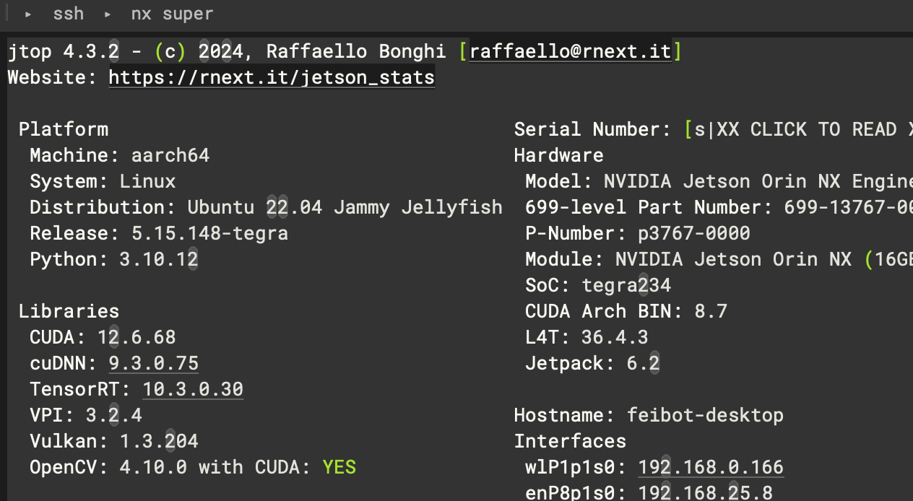

# TestRestartJetson

jetson orin nx super running restart problems

#### At present, the program will freeze completely after running on Jetson orin nx super(deepstream7.1 jetpack6.1) for 1-14 hours, 
#### and then restart the computer after a period of time. Or exit the display after running for a while (few hours)

# set-up step

## 1.my config
- 1.1 here is my jtop:

- 1.2 here is my pyds.so
replace the pyds.so in your path:
```
python3.10/site-packages/pyds.so
```

## 2.Related documents

I have opened the relevant files for debugging.
```
./aiStream/gtyIO/ioTools.py
./aiStream/gtyStream/gtyStreamUtils.py
./aiStream/gtyStream/stream_task.py
./aiStream/gtyStream/configFiles/...
./aiStream/config.ini
./aiStream/gtyConfig.py
```

- 2.1 you can try to adjust the piplines and the plugins properties of file:
```
./aiStream/gtyStream/stream_task.py
```
- 2.2 the configFiles all under the path:
```
./aiStream/config.ini
./aiStream/gtyStream/configFiles/...
```
- 2.3 the auto deleted config
```
aiStream/gtyIO/ioTools.py
add your output path to line 100 of file, so that app can auto delete normally
```
- 2.4 Algorithm configuration
```
aiStream/gtyStream/configFiles/config_jetson_infer_primary.txt
aiStream/gtyStream/configFiles/config_jetson_infer_secondary_bib.txt
tracker(modify to correct path):
aiStream/gtyStream/configFiles/dstest2_tracker_config.txt
```

## 3. run the app (I test app with 4 channels)

- 3.1 Prepare your video.(the local marathon video is 'TestRestartJetson/6sample.mp4')
the video using Ethernet local video loop streaming, for example:

```
ffmpeg -re -stream_loop -1 -i 6sample.mp4 -c copy -f rtsp rtsp://127.0.0.1:8554/stream4
```
after you run the rtsp video, config rtsp info in ./aiStream/config.ini file such as
url = rtsp://192.168.25.66:8554/stream1

- 3.2 running app under the path (./aiStream)
```
python startAiStream.py
```

## 4.my advices
- 4.1 I modify the stream_task.py (line 212) pipline properties, which related hardwares 
```
    streammux.set_property('nvbuf-memory-type', 4)
    tracker.set_property('compute-hw',2) # 1，gpu模式；2.vic模式
    nvosd.set_property('process-mode', 2)  # 0,cpu模式；1，gpu模式；2.vic模式
    #-----设置nvvideoconvert-------
    nvvidconv.set_property('compute-hw',2)
    nvvidconv.set_property('copy-hw',2)
    nvvidconv_postosd.set_property('compute-hw',2)
    nvvidconv_postosd.set_property('copy-hw',2)
    nvvidconv1.set_property('compute-hw',2)
    nvvidconv1.set_property('copy-hw',2)
    nvvidconv.set_property('nvbuf-memory-type',4)
    nvvidconv_postosd.set_property('nvbuf-memory-type',4)
    nvvidconv1.set_property('nvbuf-memory-type',4)
```
modify the aiStream/gtyStream/gtyStreamUtils.py(line 68)
```
uri_decode_bin.set_property("cudadec-memtype", 2)
```
you can try to adjust some plugins properties? I'm not sure, thank you for your help test.

if you have any other question, please feel free to connect me with 572161771@qq.com